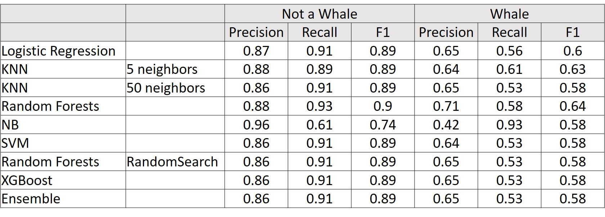
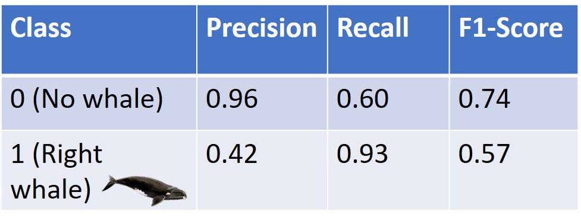
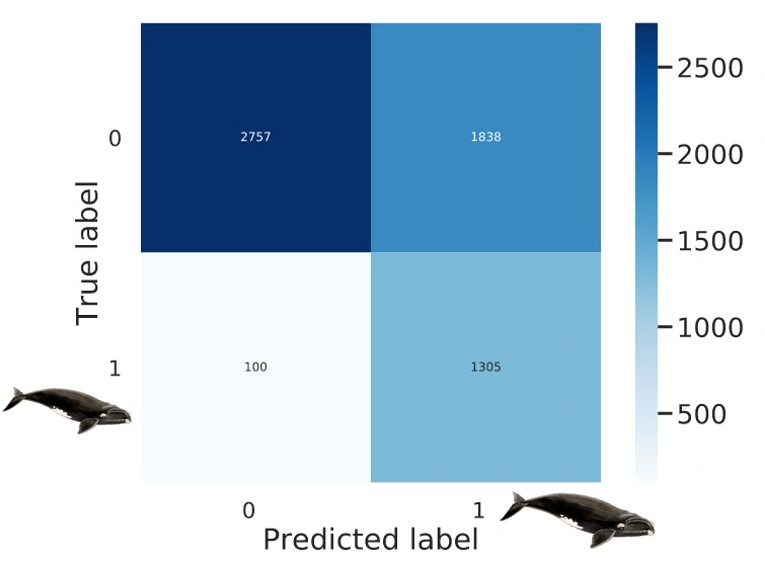

# Whale_audio_classification
## Classify audio files as either North Atlantic Right Whales or not 

## Motivation:
Nearly all whale species are endangered. Of particular note are the North Atlantic Right Whales with a population estimate of under 500 whales worldwide (ref). In addition to their low population estimates, it is alarming that their lifespans have decreased considerably from 52 years to only 15 years in recent history. With such a decreased lifespan, females have only one, maybe two opportunities to reproduce which further endangers the survival of this species. Unsurprisingly, human activity contributes to declines in whale health. The name “right whale” actually comes from whalers in the early 1900’s as these whales were the “right whales” to hunt. Additionally, as they often swim near boats, collisions with ships and entanglement in nets is not uncommon. Furthermore, sound pollution can have harmful effects on whales as they rely on sound for communication and navigation. 

In order to mitigate the harm that we cause to whales, researchers have deployed underwater recording devices (hydrophones) to listen for whale sounds. These are being used both to warn nearby ships to be cautious when whales are present, as well as to better understand whale behavior so that we may adapt our behaviors accordingly. Cornell maintains, and actively listens to, a network of hydrophones in the shipping lanes off the coast of Boston. This data has been made public through Kaggle and is the data that I used for my models. 

## Data:
30,000 audio files classified as a North Atlantic Right whale or not a North Atlantic Right Whale from Cornell University via Kaggle [Link]. 

**Challenges with the dataset:** 
* The class not right whale (label 0) could be one of several things: noise, a different whale, another sea animal, or human noise. 
* Other whales (especially humpback whales) can sound like the right whale
* Low signal-to-noise ratio

## Design: 
1.	Convert .aiff files to .wav files using ffmpeg from the command line (bash script)
2.	Extract features from audio files using the librosa package 
3.	Engineer features (see below)
4.	Use SQL to merge labels with feature database(s)
5.	Train/validate/test split with stratification 
6.	MVP – using subset of features, subset of data, and basic models
7.	Feature Selection (ExtraTreesClassifier)
8.	Scaling and Resampling
9.	Building, Validating, and Optimizing Models
10.	Select a final model, train on all train + validation data. Run on test set (held out until this point). 

## Cleaning and Feature Engineering: 
**Root features:**
* MFCC 
* Chroma
* Mel-Scaled Spectrogram
* Spectral Contrast
* Tonnetz
* Centroid
* Flatness
* Cens (Chroma Energy Normalized Statistics)
* Energy (Root Mean Square Energy) 
* Spectral Bandwith
* Spectral Contrast
* Rolloff
* Zero Crossing Rate

Each feature is returned as an array of numbers (as a string). I converted these into an array of floats and computed the mean, standard deviation, 25th percentile, 50th percentile, and 75th percentile for each feature. This resulted in a total of 70 features. 

## Algorithms:
* Logistic Regression
* KNN (k=5, k=50)
* Random Forests
* Random Forests with RandomSearchCV
* Naïve Bayes
* Support Vector Machines
* XGBoost
* Ensemble – logistic regression, random forest (optimized), naïve bayes, xgboost

The main goal of this model was to determine when whales are present in shipping lanes so that ships can be alerted. This corresponds to maximizing the recall score of the right whale (1) class. Secondarily, the model should correctly predict when a whale is not in the area so that ships can proceed normally when whales are not present. This corresponds to maximizing the precision score of the not a right whale class (0). Interestingly, most of my models preformed nearly identically to each other, with one outlier: Naïve Bayes. Optimization models (RandomSearch, XGBoost, Ensemble did not improve scores considerably). 

## Model Performance & Conclusions: 
I chose the Naïve Bayes model as it had the highest scores of the two metrics I was most interested in. The model performed approximately the same on the test data as it did on the validation data which suggests that my model was not over or under-fitting. My scores and confusion matrix are below: 

**Pros of the model:** 
* Of the right whales present – predicted 93% of them
* When predicting there was not a whale present – correct 96% of the time
* Relatively quick to run – important as the model will be deployed live
* Relatively transparent and intuitive

**Cons of the model:** 
* When predicting whales – wrong 58% of the time
* The model only predicts when right whales are present. A prediction of “no right whales” may tell ships to proceed at normal speed which would endanger other whale species. 

## Future Directions:
* Learn more about template matching
* Learn more about neural networks
* It would be great to have longer audio files to incorporate context
* Potentially try a tiered method – one algorithm following the other
* Expand to other species of whales or sea animals 
* Develop a web app which can engage the public and bring awareness to the problem

## Tools: 
* Jupyter Notebooks
* Pandas, Numpy 
* Pickles
* Seaborn
* Scikit learn
* Imblearn
* Librosa – audio package 
* ffmpeg (command line bash script)  
* SQL (postgres)
* Tableau
* Powerpoint. 

## Resources:
* Data: https://www.kaggle.com/c/whale-detection-challenge/ 
* Sound clips and spectrograms of whale species: http://cetus.ucsd.edu/voicesinthesea_org/species/baleenWhales/northPacificRight.html
* Another good sound clip: http://www.listenforwhales.org/page.aspx?pid=443
* Whale population and migration updates: http://coastalstudies.org/right-whale-research/ ; http://news.cornell.edu/stories/2017/08/right-whale-deaths-may-be-casualty-climate-crisis
* Brian McFee’s talk on Librosa (Link) 
* George Tzanetaki’s lecture on Audio Feature Extraction (Link) 
* Xavier Serra’s lecture on Audio Signal Processing for Music Applications (Link)
* Allen Downey’s talk on Basic Sound Processing in Python (Link)
* Lecture slides from University of Illinois Urbana-Champaign’s CS495 Class (Audio Features Lecture) (Link)

